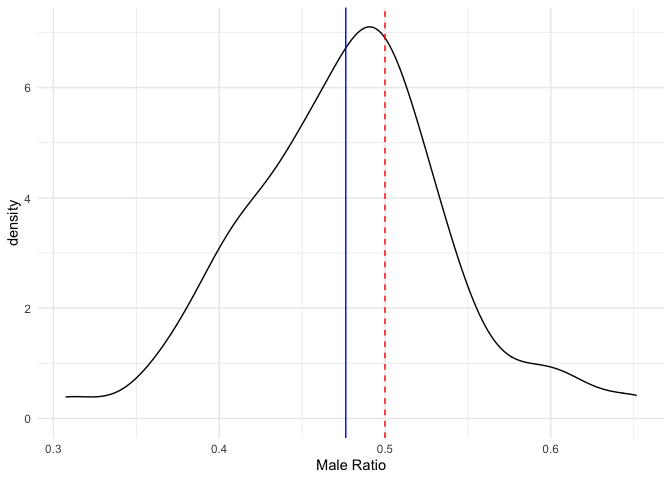
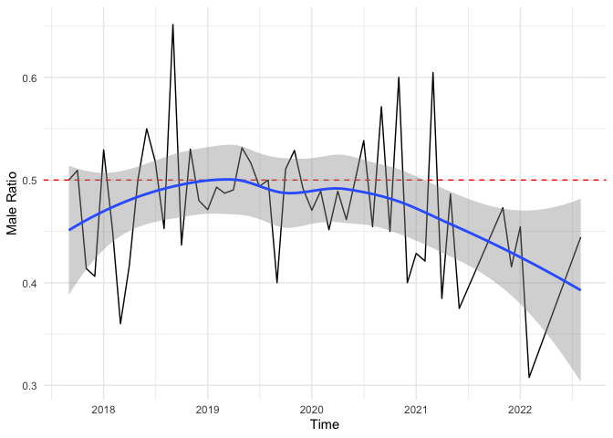
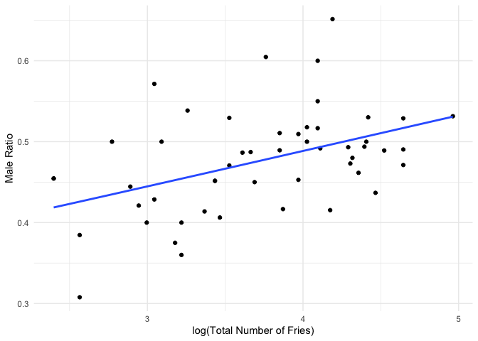
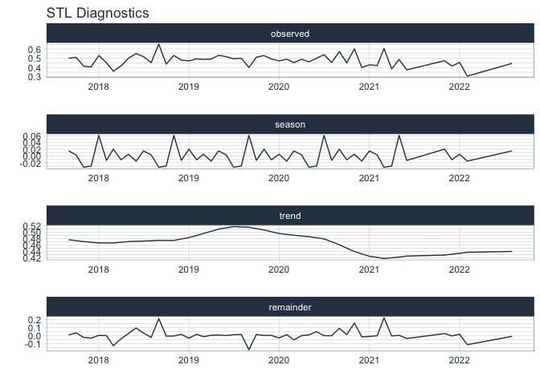
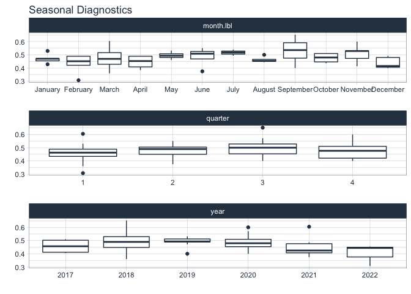
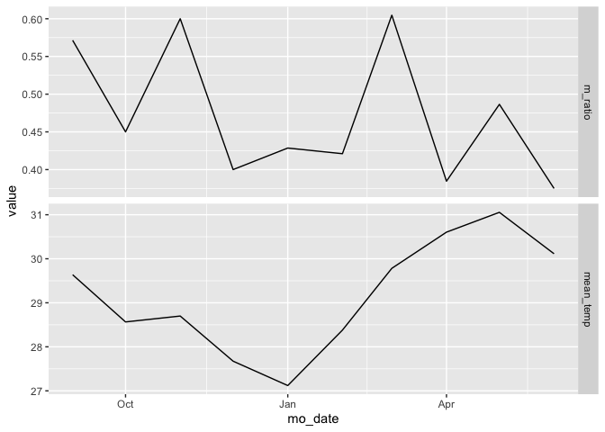

Ray Sex Ratio
================
Ekaphan Kraichak
2022-10-02

``` r
library(tidyverse)
```

    ## ── Attaching packages ─────────────────────────────────────── tidyverse 1.3.1 ──

    ## ✔ ggplot2 3.3.6      ✔ purrr   0.3.4 
    ## ✔ tibble  3.1.8      ✔ dplyr   1.0.10
    ## ✔ tidyr   1.2.1      ✔ stringr 1.4.0 
    ## ✔ readr   2.1.1      ✔ forcats 0.5.1

    ## ── Conflicts ────────────────────────────────────────── tidyverse_conflicts() ──
    ## ✖ dplyr::filter() masks stats::filter()
    ## ✖ dplyr::lag()    masks stats::lag()

``` r
library(zoo)
```

    ## 
    ## Attaching package: 'zoo'

    ## The following objects are masked from 'package:base':
    ## 
    ##     as.Date, as.Date.numeric

``` r
library(lubridate)
```

    ## 
    ## Attaching package: 'lubridate'

    ## The following objects are masked from 'package:base':
    ## 
    ##     date, intersect, setdiff, union

``` r
library(broom)
```

## Data prep

### 1) import data

``` r
ray <- read_csv("ray_brood.csv", na = "NA")
```

    ## New names:
    ## • `` -> `...7`
    ## • `` -> `...8`
    ## • `` -> `...9`

    ## Warning: One or more parsing issues, see `problems()` for details

    ## Rows: 705 Columns: 9
    ## ── Column specification ────────────────────────────────────────────────────────
    ## Delimiter: ","
    ## chr (1): Brood
    ## dbl (5): Year, Month, Date, Male, Female
    ## lgl (3): ...7, ...8, ...9
    ## 
    ## ℹ Use `spec()` to retrieve the full column specification for this data.
    ## ℹ Specify the column types or set `show_col_types = FALSE` to quiet this message.

``` r
ray
```

    ## # A tibble: 705 × 9
    ##     Year Month  Date Brood  Male Female ...7  ...8  ...9 
    ##    <dbl> <dbl> <dbl> <chr> <dbl>  <dbl> <lgl> <lgl> <lgl>
    ##  1  2017     5    27 <NA>      1      0 NA    NA    NA   
    ##  2  2017     7    10 <NA>      4      3 NA    NA    NA   
    ##  3  2017     7    22 <NA>      0      1 NA    NA    NA   
    ##  4  2017     8     7 <NA>      3      2 NA    NA    NA   
    ##  5  2017     9     4 <NA>      1      1 NA    NA    NA   
    ##  6  2017     9     7 A         0      4 NA    NA    NA   
    ##  7  2017     9     7 B         4      1 NA    NA    NA   
    ##  8  2017     9    15 <NA>      2      3 NA    NA    NA   
    ##  9  2017     9    17 <NA>      1      2 NA    NA    NA   
    ## 10  2017     9    23 <NA>      3      0 NA    NA    NA   
    ## # … with 695 more rows
    ## # ℹ Use `print(n = ...)` to see more rows

``` r
water <- read_csv("water_quality.csv", na = "NA")
```

    ## Warning: One or more parsing issues, see `problems()` for details

    ## Rows: 6220 Columns: 12
    ## ── Column specification ────────────────────────────────────────────────────────
    ## Delimiter: ","
    ## chr  (1): Pond
    ## dbl (11): Year, Month, Date, TDS, pH, DO, Ammonium, Nitrite, Hardness, Alkal...
    ## 
    ## ℹ Use `spec()` to retrieve the full column specification for this data.
    ## ℹ Specify the column types or set `show_col_types = FALSE` to quiet this message.

``` r
water
```

    ## # A tibble: 6,220 × 12
    ##     Year Month  Date Pond    TDS    pH    DO Ammonium Nitrite Hardness Alkalin…¹
    ##    <dbl> <dbl> <dbl> <chr> <dbl> <dbl> <dbl>    <dbl>   <dbl>    <dbl>     <dbl>
    ##  1  2020     6    27 L1       NA     7   6.5        0    0.02      102        68
    ##  2  2020     6    27 L2       NA     7   6.5        0    0.02      102        68
    ##  3  2020     6    27 L3       NA     7   6.5        0    0.02      102        68
    ##  4  2020     6    27 L4       NA     7   6.5        0    0.02      102        68
    ##  5  2020     6    27 L5       NA     7   6.5        0    0.02      102        68
    ##  6  2020     6    27 L6       NA     7   6.5        0    0.02      102        68
    ##  7  2020     6    27 R1       NA     7   6.5        0    0.02       51        68
    ##  8  2020     6    27 R2       NA     7   6.5        0    0.02       51        68
    ##  9  2020     6    27 R3       NA     7   6.5        0    0.02       51        68
    ## 10  2020     6    27 R4       NA     7   6.5        0    0.02       51        68
    ## # … with 6,210 more rows, 1 more variable: Temperature <dbl>, and abbreviated
    ## #   variable name ¹​Alkalinity
    ## # ℹ Use `print(n = ...)` to see more rows, and `colnames()` to see all variable names

### 2) Data at the date-level

``` r
library(lubridate)

temp_d <- water %>% 
  mutate(Actual_date = make_date(year = Year, month = Month, day = Date)) %>% 
  group_by(Actual_date) %>% 
  summarize(mean_temp = mean(Temperature, na.rm = T)) %>% 
  drop_na()

ray_d <- ray %>% 
  mutate(Actual_date = make_date(year = Year, month = Month, day = Date)) %>% 
  select(Actual_date, Male, Female) %>% 
  mutate(Total = Male + Female) %>% 
  mutate(Male_ratio = Male/Total)
```

## Temporal variation in Sex-Ratio

Here we will calculate the the sex-ratio for each month by adding all
the male and female fries produced in each calendar month and
calculating the male sex ratio by dividing the number of male fries with
the number of total fries in each month. The month with less than 10
fries was removed, as the extreme sex ratio is likely to occur in the
small population.

``` r
ray_d2 <- ray_d %>%
  mutate(mo_date = floor_date(Actual_date, unit = "month")) %>% 
  group_by(mo_date) %>% 
  summarize(across(Male:Total, sum)) %>% 
  filter(Total > 10) %>% 
  mutate(m_ratio = Male/Total)
```

### 1) Statistical Analysis

#### 1.1) Overall pattern

We performed a one-sample t-test to see if the monthly sex ratios
significantly differ from the expected ratio of 0.5, using the function
`t.test` in R.

``` r
t.test(ray_d2$m_ratio, mu = 0.5)
```

    ## 
    ##  One Sample t-test
    ## 
    ## data:  ray_d2$m_ratio
    ## t = -2.6595, df = 50, p-value = 0.01049
    ## alternative hypothesis: true mean is not equal to 0.5
    ## 95 percent confidence interval:
    ##  0.4584759 0.4942095
    ## sample estimates:
    ## mean of x 
    ## 0.4763427

The average male ratio in this population was 0.47, which was
significantly below the expected ratio of 0.5 (p = 0.01).

The density plot of the ratio data was drawn using the `ggplot2`
function to visualize the distribution of the sex ratio data. The red
dashed line represents the expected ratio at 0.5, and the solid blue
line represents the average male ratio of th population.

``` r
ray_d2 %>% 
  ggplot(aes(x = m_ratio)) +
  geom_density() +
  geom_vline(aes(xintercept = 0.5), color = "red", linetype = 2) +
  geom_vline(aes(xintercept = 0.4763427), color = "blue") +
  labs(x = "Male Ratio") +
  theme_minimal()
```

<!-- -->

#### 1.2) Chi-square test for each month

To test whether the monthly sex-ratio deviated significantly from the
expected ratio at 0.5, we performed a Chi-square test with the number of
male and female fries from each month, using the `chisq.test` function
in R.

``` r
chi_p <- function(x, y) {
  vv <- c(x, y)
  xx <- chisq.test(vv)
  yy <- xx$p.value
  yy
}

ray_d2 %>% 
  rowwise() %>% 
  mutate(chi_p = chi_p(Male, Female)) %>% 
  print(n = "all")
```

    ## # A tibble: 51 × 6
    ## # Rowwise: 
    ##    mo_date     Male Female Total m_ratio  chi_p
    ##    <date>     <dbl>  <dbl> <dbl>   <dbl>  <dbl>
    ##  1 2017-09-01    11     11    22   0.5   1     
    ##  2 2017-10-01    27     26    53   0.509 0.891 
    ##  3 2017-11-01    12     17    29   0.414 0.353 
    ##  4 2017-12-01    13     19    32   0.406 0.289 
    ##  5 2018-01-01    18     16    34   0.529 0.732 
    ##  6 2018-02-01    14     17    31   0.452 0.590 
    ##  7 2018-03-01     9     16    25   0.36  0.162 
    ##  8 2018-04-01    20     28    48   0.417 0.248 
    ##  9 2018-05-01    41     41    82   0.5   1     
    ## 10 2018-06-01    33     27    60   0.55  0.439 
    ## 11 2018-07-01    29     27    56   0.518 0.789 
    ## 12 2018-08-01    24     29    53   0.453 0.492 
    ## 13 2018-09-01    43     23    66   0.652 0.0138
    ## 14 2018-10-01    38     49    87   0.437 0.238 
    ## 15 2018-11-01    44     39    83   0.530 0.583 
    ## 16 2018-12-01    36     39    75   0.48  0.729 
    ## 17 2019-01-01    49     55   104   0.471 0.556 
    ## 18 2019-02-01    36     37    73   0.493 0.907 
    ## 19 2019-03-01    19     20    39   0.487 0.873 
    ## 20 2019-04-01    51     53   104   0.490 0.845 
    ## 21 2019-05-01    76     67   143   0.531 0.452 
    ## 22 2019-06-01    31     29    60   0.517 0.796 
    ## 23 2019-07-01    40     41    81   0.494 0.912 
    ## 24 2019-08-01    28     28    56   0.5   1     
    ## 25 2019-09-01    10     15    25   0.4   0.317 
    ## 26 2019-10-01    24     23    47   0.511 0.884 
    ## 27 2019-11-01    55     49   104   0.529 0.556 
    ## 28 2019-12-01    30     31    61   0.492 0.898 
    ## 29 2020-01-01    16     18    34   0.471 0.732 
    ## 30 2020-02-01    23     24    47   0.489 0.884 
    ## 31 2020-03-01    14     17    31   0.452 0.590 
    ## 32 2020-04-01    45     47    92   0.489 0.835 
    ## 33 2020-05-01    36     42    78   0.462 0.497 
    ## 34 2020-06-01     8      8    16   0.5   1     
    ## 35 2020-07-01    14     12    26   0.538 0.695 
    ## 36 2020-08-01     5      6    11   0.455 0.763 
    ## 37 2020-09-01    12      9    21   0.571 0.513 
    ## 38 2020-10-01    18     22    40   0.45  0.527 
    ## 39 2020-11-01    36     24    60   0.6   0.121 
    ## 40 2020-12-01     8     12    20   0.4   0.371 
    ## 41 2021-01-01     9     12    21   0.429 0.513 
    ## 42 2021-02-01     8     11    19   0.421 0.491 
    ## 43 2021-03-01    26     17    43   0.605 0.170 
    ## 44 2021-04-01     5      8    13   0.385 0.405 
    ## 45 2021-05-01    18     19    37   0.486 0.869 
    ## 46 2021-06-01     9     15    24   0.375 0.221 
    ## 47 2021-11-01    35     39    74   0.473 0.642 
    ## 48 2021-12-01    27     38    65   0.415 0.172 
    ## 49 2022-01-01     5      6    11   0.455 0.763 
    ## 50 2022-02-01     4      9    13   0.308 0.166 
    ## 51 2022-08-01     8     10    18   0.444 0.637

All of the monthly ratio, except for one record in September 2018 (p =
0.0138), did not deviate significantly from the ratio of 0.5 (p ≥
0.121).

### 2) Graphical patterns

To visualize the pattern of sex-ratio overtime, we used a line graph
with the `ggplot2` packages(Wickham 2016) in R. The red dashed line
represents the expected ratio at 0.5. The solid blue line and grey
ribbon represent the predicted values and associated 95% confidence
interval from the LOESS fit, using the `geom_smooth` function.

``` r
ray_d2 %>% 
  ggplot(aes(x = mo_date, y = m_ratio)) +
  geom_line() +
  geom_hline(aes(yintercept = 0.5), color = "red", linetype = 2) +
  geom_smooth() +
  theme_minimal() +
  labs(x = "Time", y = "Male Ratio")
```

    ## `geom_smooth()` using method = 'loess' and formula 'y ~ x'

<!-- -->

The graph indicated that the majority of ratio was slightly below the
expected ratio of 0.5. The lower ration prior to 2018, and after the
second half of 2021 appeared to be the artifact of the lower total
number of fries, as shown in the graph below.

``` r
ray_d2 %>% 
  ggplot(aes(x = log(Total), y = m_ratio)) +
  geom_point() +
  geom_smooth(method = "glm", method.args = list(family = "binomial"), se = F) +
  labs(x = "log(Total Number of Fries)", y = "Male Ratio") +
  theme_minimal()
```

    ## `geom_smooth()` using formula 'y ~ x'

    ## Warning in eval(family$initialize): non-integer #successes in a binomial glm!

<!-- -->

To test the effect of the total number of fries on the male ratio, we
applied the generalized linear model with the “binomial” error family
for the ratio data (“Proportion Data” 2012) with the function `glm` in
R.

``` r
ray_m1 <- glm(m_ratio ~ log(Total), data = ray_d2, family = "binomial")
```

    ## Warning in eval(family$initialize): non-integer #successes in a binomial glm!

``` r
summary(ray_m1)
```

    ## 
    ## Call:
    ## glm(formula = m_ratio ~ log(Total), family = "binomial", data = ray_d2)
    ## 
    ## Deviance Residuals: 
    ##      Min        1Q    Median        3Q       Max  
    ## -0.24325  -0.07639  -0.01290   0.05217   0.31160  
    ## 
    ## Coefficients:
    ##             Estimate Std. Error z value Pr(>|z|)
    ## (Intercept)  -0.7504     1.6523  -0.454    0.650
    ## log(Total)    0.1761     0.4371   0.403    0.687
    ## 
    ## (Dispersion parameter for binomial family taken to be 1)
    ## 
    ##     Null deviance: 0.81681  on 50  degrees of freedom
    ## Residual deviance: 0.65379  on 49  degrees of freedom
    ## AIC: 71.439
    ## 
    ## Number of Fisher Scoring iterations: 3

The results showed that the male ratio increased with the increasing
total number of fries, but the slope was not significantly different
from zero (p = 0.687).

### 3) Time-series analysis

We will also look at the sex-ratio data on the daily basis as a
time-series to see if any pattern emerge.

``` r
library(TSstudio)
library(timetk)

plot_stl_diagnostics(ray_d2, .date_var = mo_date, .value = m_ratio, .feature_set = c("observed", "season", "trend", "remainder"), .interactive = FALSE)
```

    ## frequency = 10 observations per 1 year

    ## trend = 12 observations per 1 year

<!-- -->

Seasonal pattern

``` r
plot_seasonal_diagnostics(ray_d2, .date_var = mo_date, .value = m_ratio, .interactive = FALSE)
```

<!-- -->

no clear seasonal pattern whatsoever

## Effect of temperature on sex-ratio

### 1) data formatting

Since the sex ratio was calculated on the monthly basis, the temperature
data will follow the same time interval for summarization

``` r
temp_d2 <- temp_d %>%   
  mutate(mo_date = floor_date(Actual_date, unit = "month")) %>% 
  group_by(mo_date) %>% 
  summarize(mean_temp = mean(mean_temp))

temp_d2
```

    ## # A tibble: 18 × 2
    ##    mo_date    mean_temp
    ##    <date>         <dbl>
    ##  1 2020-09-01      29.6
    ##  2 2020-10-01      28.6
    ##  3 2020-11-01      28.7
    ##  4 2020-12-01      27.7
    ##  5 2021-01-01      27.1
    ##  6 2021-02-01      28.4
    ##  7 2021-03-01      29.8
    ##  8 2021-04-01      30.6
    ##  9 2021-05-01      31.1
    ## 10 2021-06-01      30.1
    ## 11 2021-07-01      30.3
    ## 12 2021-08-01      30.4
    ## 13 2021-09-01      29.6
    ## 14 2022-04-01      29.1
    ## 15 2022-05-01      28.8
    ## 16 2022-06-01      30.5
    ## 17 2022-07-01      29.8
    ## 18 2022-08-01      31.4

Given that a ray takes about 100-120 days to give birth to a fry, we
will calculate the conception date (at 120 birth before birth) and half
term date (60 days before birth) as well.

``` r
temp_ray <- ray_d %>% 
  mutate(conception = floor_date(Actual_date - 120, unit = "month"), 
         halfterm = floor_date(Actual_date - 60, unit = "month"), 
         hatch_date = floor_date(Actual_date, unit = "month")) %>% 
  group_by(hatch_date, halfterm, conception) %>% 
  summarize(across(Male:Total, sum)) %>% 
  filter(Total > 10) %>% 
  mutate(m_ratio = Male/Total) %>% 
  ungroup() %>% 
  select(hatch_date:conception, m_ratio) %>% 
  filter(hatch_date <= "2021-06-01") %>%  ## date become to weird after that
  pivot_longer(hatch_date:conception, names_to = "event", values_to = "mo_date") %>% 
  right_join(temp_d2) %>% 
  drop_na()
```

    ## `summarise()` has grouped output by 'hatch_date', 'halfterm'. You can override
    ## using the `.groups` argument.
    ## Joining, by = "mo_date"

``` r
temp_ray
```

    ## # A tibble: 24 × 4
    ##    m_ratio event      mo_date    mean_temp
    ##      <dbl> <chr>      <date>         <dbl>
    ##  1   0.571 hatch_date 2020-09-01      29.6
    ##  2   0.414 hatch_date 2020-10-01      28.6
    ##  3   0.604 hatch_date 2020-11-01      28.7
    ##  4   0.604 halfterm   2020-09-01      29.6
    ##  5   0.333 hatch_date 2020-12-01      27.7
    ##  6   0.333 halfterm   2020-10-01      28.6
    ##  7   0.429 hatch_date 2021-01-01      27.1
    ##  8   0.429 halfterm   2020-11-01      28.7
    ##  9   0.429 conception 2020-09-01      29.6
    ## 10   0.421 hatch_date 2021-02-01      28.4
    ## # … with 14 more rows
    ## # ℹ Use `print(n = ...)` to see more rows

### 2) Visualize the data

visualize the time series of temperature at birth and male ratio

``` r
temp_d2 %>% 
  left_join(ray_d2) %>% 
  filter(mo_date <= "2021-06-01") %>% 
  select(mo_date, mean_temp, m_ratio) %>% 
  pivot_longer(-mo_date, names_to = "type", values_to = "value") %>% 
  ggplot(aes(x = mo_date, y = value)) +
  geom_line() +
  facet_grid(type ~ ., scales = "free_y")
```

    ## Joining, by = "mo_date"

<!-- -->

temperature at birth, conception, half-term date and male ratio

``` r
temp_ray %>% 
  ggplot(aes(x = mean_temp, y = m_ratio)) +
  geom_point() +
  geom_smooth(method = "glm", method.args = list(family = "binomial"), se = F) +
  facet_grid(~ event, scales = "free_x") +
  theme_minimal() +
  labs(x = "Average Monthly Temperature (°C)", y = "Male Ratio")
```

    ## `geom_smooth()` using formula 'y ~ x'

    ## Warning in eval(family$initialize): non-integer #successes in a binomial glm!

    ## Warning in eval(family$initialize): non-integer #successes in a binomial glm!

    ## Warning in eval(family$initialize): non-integer #successes in a binomial glm!

<!-- -->

3)  Formally testing the affect of temperature

To determine the effect of temperature at conception, halfterm, hatch
date on the sex ratio, we performed generalized linear models, using the
function `glm` with the binomial error family for the ratio data.

``` r
temp_ray %>% 
  group_by(event) %>% 
  nest() %>% 
  mutate(model = map(data, ~glm(m_ratio ~ mean_temp, data = ., family = "binomial"))) %>% 
  mutate(tidied = map(model, tidy)) %>% 
  unnest(tidied) %>% 
  filter(term == "mean_temp")
```

    ## Warning in eval(family$initialize): non-integer #successes in a binomial glm!

    ## Warning in eval(family$initialize): non-integer #successes in a binomial glm!

    ## Warning in eval(family$initialize): non-integer #successes in a binomial glm!

    ## # A tibble: 3 × 8
    ## # Groups:   event [3]
    ##   event      data              model  term      estimate std.e…¹ stati…² p.value
    ##   <chr>      <list>            <list> <chr>        <dbl>   <dbl>   <dbl>   <dbl>
    ## 1 hatch_date <tibble [10 × 3]> <glm>  mean_temp   0.0813   0.524  0.155    0.877
    ## 2 halfterm   <tibble [8 × 3]>  <glm>  mean_temp  -0.0420   0.660 -0.0636   0.949
    ## 3 conception <tibble [6 × 3]>  <glm>  mean_temp  -0.0238   1.03  -0.0230   0.982
    ## # … with abbreviated variable names ¹​std.error, ²​statistic

mean temperature did not significantly affect the male ratio at any
point in the reproductive cycle (p ≥ 0.87).

<div id="refs" class="references csl-bib-body hanging-indent">

<div id="ref-proporti2012" class="csl-entry">

“Proportion Data.” 2012. In, 628–49. John Wiley & Sons, Ltd.
<https://doi.org/10.1002/9781118448908.ch16>.

</div>

<div id="ref-ggplot2" class="csl-entry">

Wickham, Hadley. 2016. “Ggplot2: Elegant Graphics for Data Analysis.”
<https://ggplot2.tidyverse.org>.

</div>

</div>
